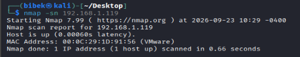
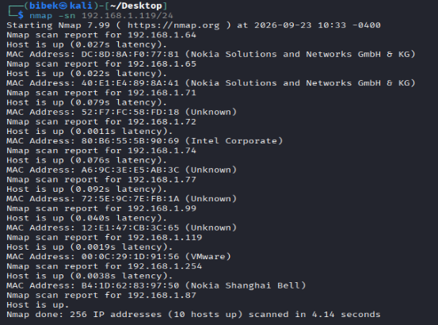
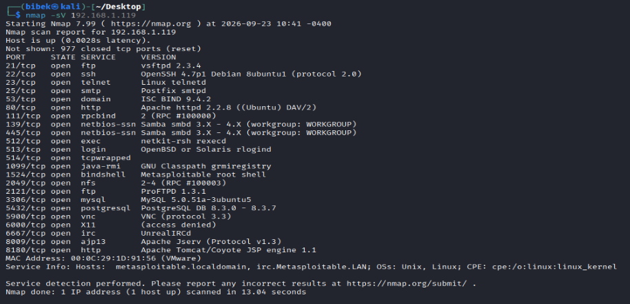
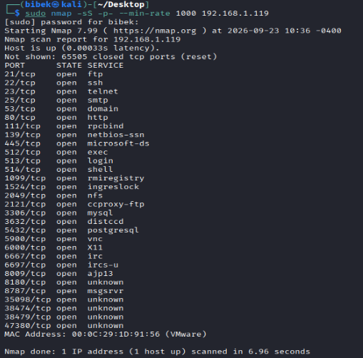
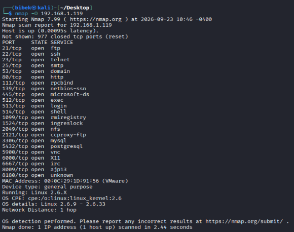
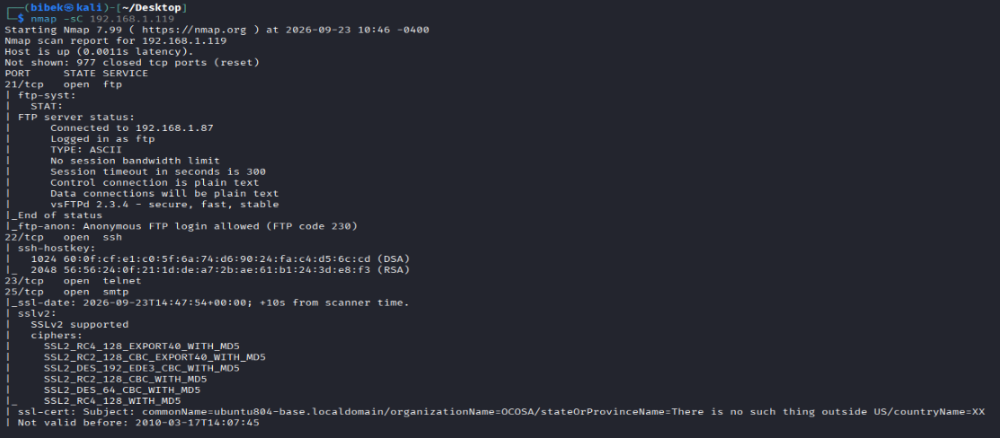
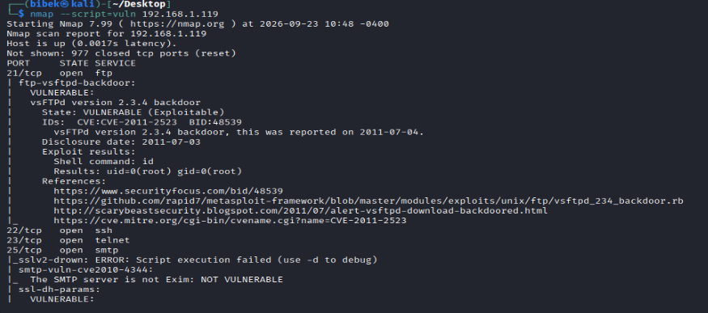

# Nmap-Practice-and-Learning

> A hands-on learning journal documenting my study and practice of **Nmap** for authorized network reconnaissance and security testing.

**Author:** Bibek Raj Joshi — BCA student, cybersecurity / ethical hacking focus


## ⚠️ Ethical Use Notice
All practice was done **only** on my own isolated virtual lab or on targets that explicitly allow scanning (e.g., `scanme.nmap.org`). Scanning systems without permission may be illegal. **No permission, no scan.** This repository is for education only.

## 📑 Table of Contents
1. [What is Nmap?](#1-what-is-nmap)
2. [Why is it used?](#2-why-is-it-used)
3. [How Nmap works](#3-how-nmap-works)
4. [Host discovery](#4-host-discovery)
5. [Port scanning and scan types](#5-port-scanning-and-scan-types)
6. [Service and version detection](#6-service-and-version-detection)
7. [OS detection](#7-os-detection)
8. [Timing and output formats](#8-timing-and-output-formats)
9. [Interpreting output](#9-interpreting-nmap-output)
10. [Nmap Scripting Engine (NSE)](#10-nmap-scripting-engine-nse)
11. [Command cheat sheet](#11-command-cheat-sheet)
12. [My hands-on practice](#12-my-hands-on-practice)
13. [Lessons learned](#13-lessons-learned)
14. [References](#14-references)

---

## 1. What is Nmap?
**Nmap** ("Network Mapper") is a free, open-source tool for network discovery and security auditing. It sends crafted packets to targets and analyzes the replies to find:
- Which hosts are **alive**
- Which **ports** are open, closed, or filtered
- Which **services and versions** are running
- The likely **operating system**
- Possible **misconfigurations/vulnerabilities** (via NSE)

**Key terms:** *Host* (device with an IP), *Port* (0–65535 endpoint), *Service* (software listening on a port), *Banner* (text a service returns), *Fingerprint* (response pattern used to identify OS/service).

## 2. Why is it used?
| Who | Use |
|-----|-----|
| Penetration testers | Reconnaissance and attack-surface mapping |
| System administrators | Asset inventory, checking exposed services |
| Blue teams | Verifying firewall rules, finding rogue devices |
| Students | Learning how networks and protocols behave |

In a workflow: *Scoping → **Scanning (Nmap)** → Enumeration → Vulnerability analysis → Reporting.* Nmap finds *what is exposed*; it does not by itself prove *what is exploitable*.

## 3. How Nmap works
**Phases of a scan:** target specification → host discovery → port scanning → (optional) service/OS detection and NSE.

**Port states**
| State | Meaning |
|-------|---------|
| `open` | A service accepts connections |
| `closed` | Reachable, nothing listening (RST reply) |
| `filtered` | No reply; a firewall is likely dropping probes |
| `unfiltered` | Reachable, open/closed unknown (ACK scan) |
| `open\|filtered` | No response; could be either (UDP, FIN, NULL, Xmas) |

**TCP handshake:** `SYN → SYN/ACK → ACK` means the port is open. A `RST` means closed. No reply means filtered.

**Privileges:** with root, Nmap can use raw packets (SYN scan `-sS`, OS detection). Without root it falls back to connect scans (`-sT`). Default scan = top 1,000 TCP ports.

## 4. Host discovery
| Command | Purpose |
|---------|---------|
| `nmap -sn 192.168.1.0/24` | Ping sweep, no port scan |
| `nmap -sn -PE <t>` | ICMP echo |
| `nmap -sn -PS22,80,443 <t>` | TCP SYN ping |
| `nmap -sn -PA80 <t>` | TCP ACK ping |
| `nmap -sn -PU53 <t>` | UDP ping |
| `nmap -sn -PR <t>` | ARP ping (local LAN, default) |
| `nmap -Pn <t>` | Skip discovery, assume host is up |
| `nmap -sL <range>` | List targets only |

Save live hosts for later:
```bash
nmap -sn 192.168.1.0/24 -oG - | awk '/Up$/{print $2}' > live-hosts.txt
nmap -iL live-hosts.txt -F
```

## 5. Port scanning and scan types
**Choosing ports:** `-F` (top 100), `-p 22,80,443`, `-p 1-1024`, `-p-` (all), `--top-ports 200`.

| Flag | Scan | Notes |
|------|------|-------|
| `-sS` | TCP SYN (half-open) | Default with root; fast |
| `-sT` | TCP Connect | No root needed; more visible in logs |
| `-sU` | UDP | Slow; needed for DNS, SNMP, DHCP |
| `-sA` | ACK | Maps firewall rules |
| `-sF` / `-sN` / `-sX` | FIN / NULL / Xmas | Results often `open\|filtered` |

```bash
sudo nmap -sS -p 1-1000 192.168.1.101
nmap -sT -p 80,443 192.168.1.101
sudo nmap -sU --top-ports 20 192.168.1.101
sudo nmap -sA -p 80,443 192.168.1.101
sudo nmap -p- --min-rate 1000 192.168.1.101
```
**Tips:** scan all TCP ports at least once; limit UDP to `--top-ports`; use `--reason` to see *why* a state was assigned.

## 6. Service and version detection
`-sV` probes open ports and matches replies against Nmap's signature database.
```bash
nmap -sV 192.168.1.101
nmap -sV --version-intensity 9 -p 21,22,80 192.168.1.101
nmap -sC -sV -oA scans/target 192.168.1.101
```
Why it matters: finds services on non-standard ports and exact versions to research against CVE databases. **Limitation:** banners can be changed, and a version match is evidence, not proof (patches may be backported).

## 7. OS detection
```bash
sudo nmap -O 192.168.1.101
sudo nmap -O --osscan-guess 192.168.1.101
sudo nmap -A 192.168.1.101      # -O -sV -sC --traceroute
```
Needs root and works best with at least one open and one closed TCP port. Results are **probabilistic**; firewalls, NAT, and VMs can skew them. Cross-check with banners.

## 8. Timing and output formats
| Flag | Template | Use |
|------|----------|-----|
| `-T2` | Polite | Lower load on target |
| `-T3` | Normal | Default |
| `-T4` | Aggressive | Fast, reliable lab networks |
| `-T5` | Insane | May miss ports |

| Flag | Format |
|------|--------|
| `-oN` | Normal text |
| `-oX` | XML |
| `-oG` | Grepable |
| `-oA base` | All three (recommended) |

Useful extras: `-v`, `--open`, `--reason`, `--packet-trace`, `--resume`. HTML report: `xsltproc scan.xml -o scan.html`.

## 9. Interpreting Nmap output
Illustrative sample (not from a real target):
```
Nmap scan report for 192.168.1.101
Host is up (0.00045s latency).
Not shown: 995 closed tcp ports (reset)
PORT    STATE SERVICE VERSION
21/tcp  open  ftp     vsftpd 2.3.4
22/tcp  open  ssh     OpenSSH 4.7p1
80/tcp  open  http    Apache httpd 2.2.8
```
**My reading checklist:** (1) Is the host up? (2) What is open, and does it need to be exposed? (3) Which exact versions? (4) What is filtered (firewall)? (5) Any script findings to verify? (6) Record command + date.

| Finding | Why it matters |
|---------|----------------|
| Telnet/FTP open | Cleartext protocols |
| SMB (445) exposed | Frequent target; check patches |
| Outdated web server | Likely known CVEs |
| Exposed DB ports | Rarely should face untrusted networks |
| Anonymous FTP | Information disclosure |

## 10. Nmap Scripting Engine (NSE)
NSE runs **Lua scripts** for discovery, enumeration, and vulnerability checks (`/usr/share/nmap/scripts/`, docs: https://nmap.org/nsedoc/).

**Categories:** `auth`, `broadcast`, `brute`, `default`, `discovery`, `dos`, `exploit`, `external`, `fuzzer`, `intrusive`, `malware`, `safe`, `version`, `vuln`.
> ⚠️ `brute`, `dos`, `exploit`, `fuzzer`, `intrusive` can disrupt services. Only use on my own throwaway lab VMs.

```bash
nmap -sC 192.168.1.101
nmap --script=safe 192.168.1.101
nmap --script=vuln 192.168.1.101
nmap --script=http-title,http-headers,http-methods -p 80 <t>
nmap --script=ftp-anon -p 21 <t>
nmap --script=ssh-hostkey -p 22 <t>
nmap --script=smb-os-discovery,smb-enum-shares -p 445 <t>
nmap --script=ssl-enum-ciphers -p 443 <t>
nmap --script-help=http-enum
```
| Script | Purpose |
|--------|---------|
| `http-title` / `http-headers` / `http-methods` | Web server info |
| `http-enum` | Common web directories/apps |
| `ftp-anon` | Anonymous FTP check |
| `ssh-hostkey` | SSH key fingerprints |
| `smb-os-discovery` / `smb-enum-shares` | SMB info and shares |
| `ssl-cert` / `ssl-enum-ciphers` | Certificate and TLS review |
| `banner` | Raw service banners |

Script output is a **lead to verify**, not final proof.

## 11. Command cheat sheet
```bash
# Targets
nmap 192.168.1.101 | nmap 192.168.1.1-50 | nmap 192.168.1.0/24 | nmap -iL targets.txt

# Recommended workflow
nmap -sn 192.168.1.0/24 -oA scans/01-discovery
sudo nmap -p- --min-rate 1000 -oA scans/02-allports <target>
sudo nmap -sC -sV -O -p <open-ports> -oA scans/03-detailed <target>
nmap --script=vuln -p <open-ports> -oA scans/04-vuln <target>
```

## 12. My hands-on practice

### Lab environment
| Item | Details |
|------|---------|
| Scanner | _Kali Linux  |
| Nmap version | Nmap version 7.99 |
| Virtualization | VMware |
| Network | Isolated host-only network, `192.168.1.0/24` |
| Targets | Metasploitable 2, DVWA,  scanme.nmap.org_ |

### Screenshot evidence









### Practice log
| # | Date | Target | Command | What I found |
|---|------|--------|---------|--------------|
| 1 | 2026-09-23 | 192.168.1.19 | `nmap -sn 192.168.1.0/24` | 192.168.1.119 |
| 2 | 2026-09-23 | 192.168.1.19| `sudo nmap -sS -p- --min-rate 1000 192.168.1.119` | 21,22,23,25,80 ect. |
| 3 | 2026-09-23 | 192.168.1.19| `nmap -sV 192.168.1.119` |ftp/vsftpd 2.3.4,ssh/OpenSSH 4.7p1 Debian 8ubuntu1 (protocol 2.0),telnet/Linux telnetd,smtp Postfix smtpd,http/Apache httpd 2.2.8 ((Ubuntu) DAV/2) |
| 4 | 2026-09-23 | 192.168.1.19| `sudo nmap -O 192.168.1.119` | Linux 2.6.9 - 2.6.33 |
| 5 | 2026-09-23 | 192.168.1.19| `nmap -sC 192.168.1.119` | 21/tcp   open  ftp ftp-syst: STAT: 
FTP server status: Connected to 192.168.1.87 Logged in as ftp TYPE: ASCII No session bandwidth limit Session timeout in seconds is 300 Control connection is plain text Data connections will be plain text vsFTPd 2.3.4 - secure, fast, stable_End of status_ftp-anon: Anonymous FTP login allowed (FTP code 230)|
| 6 | 2026-09-23 | 192.168.1.19| `nmap --script=vuln 192.168.1.119` |  |

### Mini report 
| Port | Service | Version | Risk / Note |
|------|---------|---------|-------------|
| 21/tcp | ftp | vsftpd 2.3.4 | VSFTPD Backdoor: Sending a username containing a smiley face :) triggers a hidden backdoor, instantly spawning a root shell on port 6200.|
| 22/tcp | ssh | OpenSSH 4.7p1 Debian 8ubuntu1 (protocol 2.0) | Weak/Default Credentials: Vulnerable to brute-force attacks. Default system credentials (msfadmin:msfadmin) grant full terminal access.|
| 23/tcp | telnet | Linux telnetd | Cleartext Transmission: Transmits all user credentials and commands in plain text, heavily exposed to packet sniffing.|
| 80/http | http |  httpd 2.2.8  | Web App Flaws: Hosts vulnerable web applications like DVWA, Mutillidae, and phpMyAdmin, which are susceptible to SQL Injection, XSS, and command injection|


## 13. Lessons learned
- Discovery first; `-Pn` is a fallback, not a default.
- Scan all ports at least once; the default top 1,000 can miss services.
- `filtered` means "no answer", not "nothing there".
- Versions and script output are leads to verify, not proof.
- OS detection is a guess; cross-check with banners.
- Save everything with `-oA` for reproducible notes.
- Authorization comes before any packet is sent.

**Mistakes and fixes:** _add my own (e.g., ran `-O` without sudo; trusted an NSE result without verifying)._

**Next steps:** watch Nmap traffic in Wireshark, write a simple NSE script, compare with Masscan/OpenVAS in my lab.

## 14. References
- https://nmap.org — official site
- https://nmap.org/book/man.html — reference guide
- https://nmap.org/nsedoc/ — NSE script docs
- *Nmap Network Scanning* by Gordon "Fyodor" Lyon — https://nmap.org/book/


